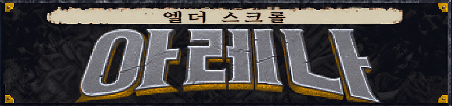

# The Elder Scrolls: Arena 한국어 패치

Steam판 **The Elder Scrolls: Arena 1.07 CD-ROM**을 원본 DOS 엔진 그대로 실행하면서 한국어를 표시하기 위한 비공식 팬 번역 프로젝트다.

이 프로젝트는 Bethesda 또는 Microsoft와 관련이 없다. 사용자는 정식으로 설치한 게임 파일을 직접 보유해야 한다. 공개 배포물에는 게임 전체나 Bethesda 원본 아카이브를 넣지 않고, 지원 버전의 원본 해시를 검사한 뒤 차이만 적용하는 패처를 제공하는 것을 목표로 한다.

## 설치 및 사용

1. 저장소의 `Code` → `Download ZIP`을 누르거나 [GitHub Releases](https://github.com/madamnut/elder-scrolls-arena-korean/releases)에서 최신 `Arena-Korean-Patch-v<버전>.zip`을 받는다.
2. 받은 ZIP을 원하는 폴더에 완전히 압축 해제한다.
3. 압축을 푼 폴더의 `Installer.bat`을 더블클릭한다.
4. 메뉴에서 `1`번을 선택하고 `INSTALL`을 입력한다.
5. 설치가 끝나면 Steam에서 평소처럼 전체 화면 또는 창 모드로 실행한다.

저장소 ZIP과 릴리스 ZIP 모두 압축을 풀면 최상단에 `Installer.bat`이 있다. 설치기는 Steam 라이브러리에서 Arena 경로를 자동으로 찾는다. 찾지 못할 때만 설치 폴더를 직접 입력받는다. 설치 과정과 진행률이 화면에 표시되며, 파일 검증이나 적용에 실패하면 이번 실행의 변경 사항을 자동으로 되돌린다.

### 설치기 메뉴

```text
[1] 한글 패치 설치 또는 현재 패키지로 업데이트
[2] 최신 버전 확인 및 자동 업데이트
[3] 설치 상태 검사
[4] 원본 실행 설정 복구
[0] 종료
```

4번 복구는 Steam 실행 설정을 원본으로 되돌린다. 한글판 세이브 보호를 위해 `ARENA_KR`은 지우지 않는다. 자세한 동작은 [설치기 구현과 사용법](docs/INSTALLER.ko.md)을 참고한다.

제작: **madamnut**

저장소: <https://github.com/madamnut/elder-scrolls-arena-korean>

## 현재 상태

### 완료 또는 실행 확인

- 2바이트 내부 한글 인코딩 `AKC`
- DOS TSR 기반 한글 비트맵 렌더러
- 원본 ASCII와 한글 혼합 출력
- 글자 폭 계산, 가운데 정렬 및 기본 자동 줄바꿈 연결
- 한글 타이틀 이미지와 원본 저작권 문구 유지
- 타이틀 이후 캐릭터 생성 진입 전까지의 이미지 기반 화면
- 새 게임 메뉴와 오프닝 줄거리 이미지 9장
- 캐릭터 생성 방식 선택 화면
- `생성`, `선택`, `남성`, `여성`
- 직업 판정 안내문
- 직업 판정 질문 40개와 선택지 120개
- 원본 `QUESTION.TXT`를 보존하는 별도 `QUEST_KR.TXT` 로딩
- 원본과 분리된 `GLOBAL_K.BSA`, `INTKR.FLC`, `TEMPL_KR.DAT`
- 직업 선택, 이름·성별·출신 지역 선택, 혈통 안내, 능력치 배분과 외형 선택
- 탐리엘 지역 지도와 지역명, 능력치 UI, 메인 메뉴의 이미지 고정 글자
- 리아 실메인 첫 꿈 키 1400의 한글 자막과 37픽셀 자막 밴드
- 첫 던전 환경 설명과 공통 조작·인벤토리·장비 UI 문구
- 몬스터, 무기·방어구·재질·물약 등 런타임 이름
- 원본 텍스트 카탈로그 1,934개 중 번역 대상 1,869개 전체의 1차 번역
- 도시·NPC 대화·장소 안내·상점·길드·주점·주문 제작·던전·아티팩트 퀘스트 초벌 번역
- 엔진 비교용 수수께끼 정답과 내부 식별자를 보존한 잔존 영문 감사

### 작업 중

- 작은 글꼴에서 한글 행간과 밀도 조정
- 전체 초벌 번역의 문맥·문체·줄바꿈·목록 행간 실기 교정
- 본편 UI의 이미지 고정 글자와 저장·불러오기 잔여 화면 점검
- 첫 본편 리아 실메인 꿈 키 1500·1294 실기 검증과 후속 꿈 키 1295~1302
- 제이거 탄과 엔딩을 포함한 나머지 런타임 컷신 자막
- 설치기의 실제 사용자 환경 추가 검증과 릴리스 자동화

## 지원 대상

| 항목 | 값 |
|---|---|
| 게임 | The Elder Scrolls: Arena |
| 배포판 | Steam CD-ROM판 |
| 게임 버전 | 1.07 |
| 실행 환경 | 포함된 DOSBox 0.74 |
| 원본 `ACD.EXE` SHA-256 | `40dfed48a66154feeda2dc33b9549570b4392874750101f264e7de25ece98a7d` |
| 언팩 EXE SHA-256 | `3d698ac22c1f7da49d87c78d80f89f3c3822ba3f62708b67f98fff3dac300a86` |

해시가 다른 실행 파일에는 패치를 강제로 적용하지 않는다. 다른 언어판이나 GOG판 지원은 별도의 원본 조사와 매니페스트가 필요하다.

## 개발용 한글 실행 환경

현재 작업 폴더에서는 다음 파일을 사용한다.

```text
ARENA_KR/ACDKR.EXE
ARENA_KR/ARENAKR.COM
ARENA_KR/CUTSCN.CCH
ARENA_KR/HANGUL.FNT
ARENA_KR/HANGUL12.FNT
ARENA_KR/HANGUL16.FNT
ARENA_KR/GLOBAL_K.BSA
ARENA_KR/INTKR.FLC
ARENA_KR/VISION.FLC
ARENA_KR/CHAOSVSN.FLC
ARENA_KR/TEMPL_KR.DAT
ARENA_KR/QUEST_KR.TXT
```

`ARENA_KR`은 정품 설치본 `ARENA`에서 사용자 PC에 로컬로 생성하는 한글 전용 런타임이다. 원본 실행과 한글 실행이 느슨한 이미지 파일을 공유하지 않도록 두 디렉터리를 분리한다. 배포용 설치기는 원본 `arena.conf`를 백업한 뒤 Steam의 기존 전체 화면·창 모드 실행이 이 런타임을 사용하게 한다. 개발판 실행 전에는 DOSBox를 완전히 종료해야 갱신된 TSR이 다시 적재된다.

## 기술 개요

Arena의 원본 글꼴은 ASCII 중심의 가변폭 비트맵이다. 완성형 한글 음절은 프로젝트 전용 `AKC` 2바이트 인코딩으로 저장한다.

```text
S = Unicode 완성형 한글 인덱스 (가=0, 힣=11171)
첫 바이트 = 0x80 + (S >> 7)
둘째 바이트 = 0x80 + (S & 0x7F)
```

패치한 `ACDKR.EXE`의 폭 계산·문자 그리기 루틴은 `INT 60h`를 호출한다. `ARENAKR.COM` TSR은 ASCII를 원본과 호환되게 처리하고 AKC 한글은 현재 영문 글꼴 높이에 맞는 `HANGUL.FNT`, `HANGUL12.FNT`, `HANGUL16.FNT`에서 읽어 화면에 그린다. 컷신을 재생하기 전에는 `CUTSCN.CCH`에서 해당 장면의 한글 음절만 상주 캐시로 옮겨 영상 메모리와의 충돌을 피한다.

자세한 구조는 [아키텍처 문서](docs/ARCHITECTURE.ko.md)와 [역공학 기록](REVERSE_ENGINEERING.md)을 참고한다.

## 문서

- [아키텍처와 런타임 구조](docs/ARCHITECTURE.ko.md)
- [한글 폰트 정책과 라이선스](docs/FONTS.ko.md)
- [설치기 구현과 사용법](docs/INSTALLER.ko.md)
- [개발 및 빌드 절차](docs/DEVELOPMENT.ko.md)
- [번역·문체·자리표시자 규칙](docs/TRANSLATION.ko.md)
- [전체 번역 진행 현황](docs/TRANSLATION_STATUS.ko.md)
- [번역 잔존 영문 감사](docs/TRANSLATION_RESIDUE.ko.md)
- [실행 시험과 회귀 테스트](docs/TESTING.ko.md)
- [런타임 컷신 호출 매트릭스](docs/CUTSCENE_MATRIX.ko.md)
- [장면별 컷신 한국어 대사](docs/CUTSCENE_DIALOGUE.ko.md)
- [GitHub 및 릴리스 배포 정책](docs/DISTRIBUTION.ko.md)
- [개발 디렉터리 구조](docs/DIRECTORY_LAYOUT.ko.md)
- [파일 인벤토리와 소유권](docs/FILE_INVENTORY.ko.md)
- [기여 안내](CONTRIBUTING.ko.md)
- [변경 기록](CHANGELOG.md)
- [컷신 현황](CUTSCENES.md)
- [ACD.EXE 역공학 기록](REVERSE_ENGINEERING.md)

## 저장소에 포함할 것

- 직접 작성한 Python 도구와 어셈블리 소스
- UTF-8 한국어 번역 원본
- 설치기, 매니페스트, 테스트 및 문서
- 라이선스 조건을 지킨 자체 생성 런타임 파일

## 저장소에서 제외할 것

- Bethesda 원본 게임 파일
- 완성 `GLOBAL_K.BSA`, `ACDKR.EXE`, FLC·IMG 수정본
- 원본 그림이 포함된 추출·편집 PNG
- `analysis/`, `build/`, `backup/`, `reference/`, `artist-handoff/`
- 개인 세이브와 DOSBox 캡처

Git LFS는 원본 게임 파일을 공개해도 된다는 허가가 아니므로 해결책으로 사용하지 않는다.

## 라이선스

- 프로젝트 코드의 공개 라이선스는 저장소 공개 전에 별도로 결정한다.
- 한글 글리프 뱅크는 기반 폰트의 SIL Open Font License 1.1 조건을 따르며, 자세한 의무는 [폰트 정책 문서](docs/FONTS.ko.md)에 기록한다.
- 배포 델타는 프로젝트가 직접 구현한 `arena-korean-delta-v1` 형식을 사용한다.
- 게임 이름, 원본 코드, 그림, 음악, 음성 및 데이터의 권리는 각 권리자에게 있다.

## 안전 원칙

1. 원본 해시가 일치하지 않으면 중단한다.
2. 원본을 직접 패치하지 않고 임시 출력에 적용한다.
3. 출력 해시를 확인한 뒤에만 설치한다.
4. 같은 이름으로 교체해야 하는 파일은 먼저 백업한다.
5. 실패하면 설치 이전 상태로 자동 롤백한다.
6. 세이브 파일은 검사·이동·삭제하지 않는다.
7. 제거기는 설치 상태 파일에 기록된 항목만 복원하거나 삭제한다.
